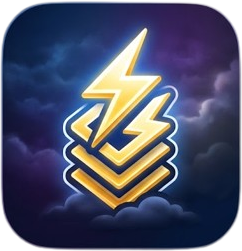
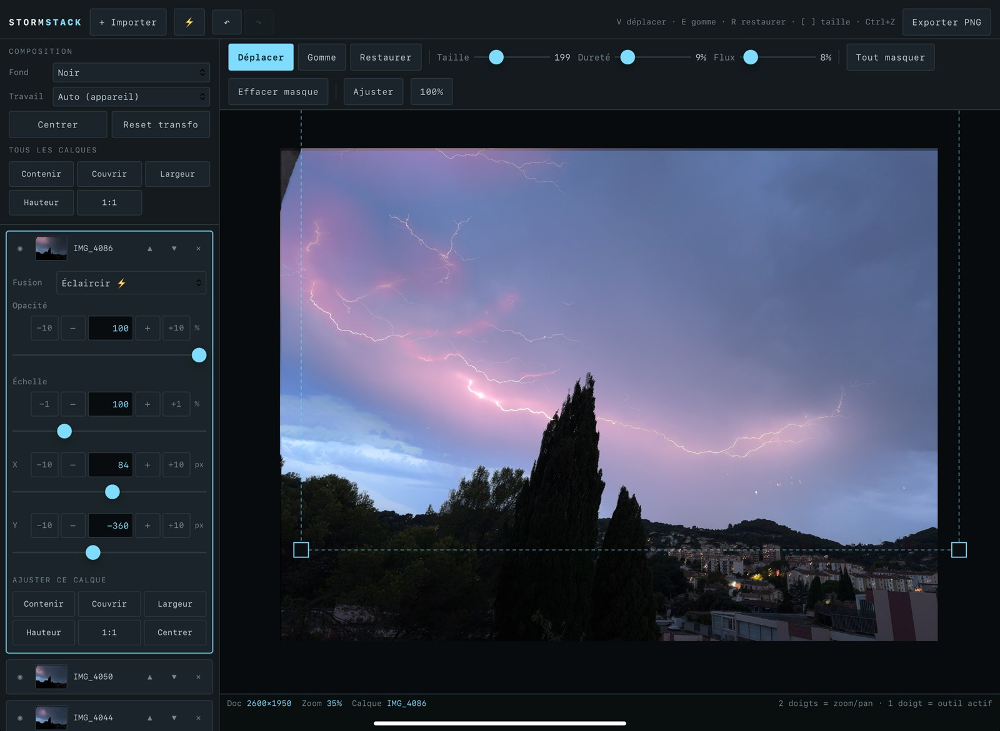

<p align="center">
  
</p>

<h1 align="center">STORMSTACK</h1>

<p align="center">
  Stack lightning photos in the browser. One HTML file, no server, nothing uploaded.
</p>

<p align="center">
  <a href="https://infinition.github.io/stormstack/"><b>Open the app</b></a>
</p>

<p align="center">
  
</p>

---

## What it does

Shooting a thunderstorm gives you a burst of near identical frames, each with a bolt or two.
Stormstack layers them and blends with Lighten, which keeps only the brightest pixel of each layer.
The result is every bolt of the sequence on a single image, with the background sky untouched.

Each layer carries a mask you paint by hand. The mask lives in image coordinates, so it follows the
layer when you move or scale it.

Everything runs in the tab. Your photos never leave the machine.

## Using it

1. Drop your photos anywhere on the page, or click **+ Import**.
2. The first layer stays Normal, the ones above switch to **Lighten**. The ⚡ button forces every
   layer above the base into that mode.
3. Hit **Auto align**. Handheld bursts drift a few pixels between frames, this puts them back on top
   of each other.
4. Adjust: drag the image on the canvas, pull a **corner handle** to scale, or type exact values in
   the panel.
5. **Erase** removes an area of the active layer, a stray bolt or a reflection. **Restore** brings it
   back. Or let **Auto mask** hide everything below a luminance, which isolates the bolt without
   painting anything.
6. **Export**.

### Auto align

Registers every layer against the bottom one by image content. It works on a gradient pyramid, so
exposure differences and the bolts themselves, present in one frame only, do not throw it off. The
match is refined below the pixel and lands exact on a clean burst. Locked layers are left alone.

### Auto mask

A per layer luminance threshold that hides everything darker than the cut, with a soft edge. On a
night sky it isolates the bolt in one slider move. Painting with the brush afterwards takes over,
and the threshold resets to zero to say so.

### Projects

Name a project and press **Save**. It goes into the browser: the index in localStorage, the images
in IndexedDB. From then on it keeps itself up to date as you work, and reopens on its own the next
time you come back. **New** starts a fresh one, **Open** lists what you have saved.

Nothing is saved before you name and save it once, so an experiment never leaves a trace behind.

### Project files

**Save to disk** writes the whole project, layers, masks, transforms and all, to a single `.storm`
file you can back up, move between machines or keep alongside the source photos.
**Open from disk** loads one back, and dropping a `.storm` on the window does the same.

The format is a plain container, not an archive format you need a tool for:

```
0  .. 7    "STORMSTK"
8  .. 11   uint32 LE   format version
12 .. 15   uint32 LE   manifest length in bytes
16 ..      manifest, UTF-8 JSON
then       the images back to back, located by offset and length in the manifest
```

Layer sources are WebP, masks are PNG, both stored raw rather than base64, which would have added a
third to every file. A project loaded from disk starts unsaved: press **Save** if you also want it
in the browser.

### Compare

Hold the ◑ button, or the `\` key, to see the base layer alone. Release to get the stack back.

### Snapping

While dragging or resizing, layers snap to the document edges and centre, and to the edges and
centres of the other layers. Resizing also snaps to 100 %, contain, cover, width and height.
Red guides show what caught. Hold `Alt` to suspend it, or toggle the **Snap** button.

### Fitting

Per layer and for the whole stack: `Contain`, `Cover`, `Width`, `Height`, `1:1`, `Center`.
Useful when the frames do not all come from the same body or the same crop.

### Fine control

Opacity, scale, X, Y and the auto mask threshold each have a slider, a direct input field and fine
steps. X and Y move one pixel at a time with `+1` / `-1`, ten with `+10` / `-10`, and with the arrow
keys.

Layers can be locked, which freezes them against dragging, handles, arrows and auto align, and
duplicated, which copies the transform and the mask.

### Export

PNG, JPEG or WebP, with a quality slider for the lossy ones. Two sizes: the working document, or
full resolution, which re-decodes the original files and recomposes at their real pixel size. Full
resolution needs those files, so it is unavailable for layers reopened from a saved project, which
only keep their working copy.

## Languages

English by default, French available. The `EN` / `FR` buttons in the header switch instantly and the
choice is remembered. All strings live in a single `I18N` table, so adding a language means adding
one entry.

## Shortcuts

| Key | Action |
| --- | --- |
| `V` | Move |
| `E` | Erase |
| `R` | Restore |
| `S` | Toggle snapping |
| `\` (held) | Compare with the base layer |
| `Tab` | Canvas only |
| `Alt` (held) | Suspend snapping |
| `[` `]` | Brush size |
| Arrows | Move layer by 1 px (10 px with `Shift`) |
| `F` | Fit view |
| `Esc` | Close the layer panel |
| `Ctrl` + `Z` | Undo |
| `Ctrl` + `Shift` + `Z` | Redo |
| Wheel | Zoom |
| Space or right click | Pan |

## Phone and tablet

The interface adapts to touch: larger targets, collapsible layer panel, bigger resize handles, and
margins that respect display cutouts.

- One finger: active tool.
- Two fingers: zoom and pan.
- Tapping outside the layer panel closes it.
- `Tab`, or the ⛶ button, hides both panels and leaves the canvas alone.

On iOS, `Share → Add to Home Screen` installs it fullscreen. On export the PNG opens in a tab:
`Share → Save to Photos`.

## Formats and limits

Supported formats are whatever the browser decodes: JPEG, PNG, WebP, AVIF, TIFF, GIF, BMP.

**HEIC** is not decodable by any desktop browser. If your photos come from an iPhone, set
`Settings → Camera → Formats → Most Compatible`, or convert them to JPEG. The app detects the case
and says so.

Working resolution is capped to fit in canvas memory, which is tight on iOS. The **Working** setting
runs from 2048 px to full resolution and applies to subsequent imports. If export fails for lack of
memory, lower it.

## Storage

Projects live in your browser, never on a server, and clearing site data removes them. Use **Save to
disk** for anything you want to keep, or export the image.

The app makes no network requests at all: no CDN, no fonts, no analytics, no service worker. It is a
static page, which is why it runs unchanged on GitHub Pages, from a local file, or offline.

## Running locally

No dependencies, no build step. Download `index.html` and open it. The file is self contained,
icons included, and works offline.

## License

MIT.
